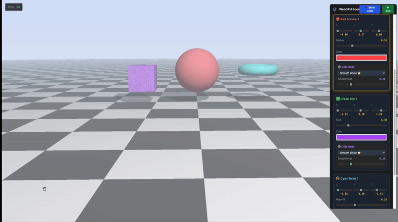

# WebGPU Interactive 3D Scene Editor

A real-time 3D scene editor built with WebGPU and ray marching techniques. Create and manipulate geometric primitives (spheres, boxes, tori) directly in the viewport with an intuitive interface and powerful CSG operations.



## Live Demo

**[Try it live](https://thenarciss.github.io/AICG/)**


## Overview

This project transforms a basic WebGPU shader playground into a fully interactive 3D scene editor. Unlike traditional polygon-based renderers, this editor uses signed distance fields (SDFs) and ray marching to render scenes in real-time, enabling smooth CSG operations and precise object manipulation.

## Features

### Core Functionality
- **Real-time Scene Editing** - Modify object properties and see changes instantly without recompilation
- **Dynamic Object Management** - Add or remove up to 10 spheres, 10 boxes, and 10 tori
- **Interactive Viewport** - Click to select objects, drag to reposition them in 3D space
- **CSG Operations** - Five blend modes for combining objects:
  - Normal (with automatic smooth propagation)
  - Smooth Union
  - Subtract (boolean difference)
  - Intersect (boolean intersection)
  - XOR (exclusive or)

### Advanced Features
- **Live Shader Editing** - Write and compile WGSL shaders on the fly with syntax highlighting
- **Orbit Camera** - Intuitive camera controls with mouse drag and scroll zoom
- **Selection Highlighting** - Selected objects are automatically highlighted in the UI
- **Smooth Blend Propagation** - Smooth objects influence nearby normal objects for organic transitions
- **Per-object Color Control** - Full RGB color picker for each primitive
- **Adjustable Smoothness** - Fine-tune blend strength for each CSG operation

### Technical Details
- GPU-accelerated ray marching with configurable step count
- Phong shading with shadow casting
- Exponential distance fog
- Checkerboard ground plane with proper lighting
- Dynamic uniform buffers for scene data
- WGSL struct alignment with proper padding

## Technology Stack

- **WebGPU** - Modern GPU API for high-performance rendering
- **WGSL** - WebGPU Shading Language for compute and fragment shaders
- **JavaScript (ES6+)** - Application logic and event handling
- **HTML5 Canvas** - Rendering surface
- **Tailwind CSS** - Utility-first styling
- **CodeMirror 5** - Code editor with syntax highlighting

## Getting Started

### Prerequisites

- A WebGPU-compatible browser (Chrome 113+, Edge 113+, or Safari Technology Preview)
- A local web server (required for loading shaders via fetch)

### Installation

1. Clone the repository:
```bash
git clone https://github.com/TheNarciss/webgpu-scene-editor.git
cd webgpu-scene-editor
```

2. Start a local server:
```bash
python -m http.server 8000
```

Alternatively, use Node.js:
```bash
npx http-server -p 8000
```

3. Open your browser to `http://localhost:8000`

### Usage

**Adding Objects:**
- Click the "+Sphere", "+Box", or "+Torus" buttons in the Scene Editor panel
- Objects are initialized at evenly-spaced positions

**Selecting Objects:**
- Click directly on an object in the viewport
- The corresponding UI panel will scroll into view and highlight

**Moving Objects:**
- Click and drag selected objects in the viewport
- Use Shift+Drag on empty space to pan the camera
- Scroll to zoom in/out

**Editing Properties:**
- Use sliders to adjust position (X, Y, Z), size, and CSG smoothness
- Click the color picker to change object color
- Select a blend mode from the dropdown

**Camera Controls:**
- Left-click + drag: Rotate camera around scene
- Shift + left-click + drag: Pan camera
- Mouse wheel: Zoom in/out

**Code Editor:**
- Click "Code" button to toggle shader editor
- Edit WGSL fragment shader code
- Press Ctrl+Enter (Cmd+Enter on Mac) or click "Run" to compile

## Project Structure

```
webgpu-scene-editor/
├── index.html              # Main application file (all-in-one)
├── shaders/                # WGSL shader files
│   ├── raymarch_basic.wgsl # Main ray marching shader
│   ├── id_pick.wgsl        # Object picking shader (unused in current version)
│   ├── perlin_noise.wgsl   # Noise generators
│   ├── fbm_perlin_noise.wgsl
│   ├── simple_noise.wgsl
│   ├── mouse.wgsl          # Mouse interaction demo
│   ├── raymarch_glass.wgsl # Glass/metal materials demo
│   └── manifest.json       # Shader metadata
├── object_picker.js        # Legacy picker module (for reference)
├── README.md               # This file
└── .nojekyll               # GitHub Pages configuration
```

## Architecture

### Scene Data Structure

The scene is stored in a GPU uniform buffer with the following layout:

**Header (16 bytes):**
- `num_spheres: u32`
- `num_boxes: u32`
- `num_tori: u32`
- `padding: u32`

**Primitives:**
- Spheres: 10 × 48 bytes (12 floats: center, radius, color, blend_mode, blend_amount, padding)
- Boxes: 10 × 64 bytes (16 floats: center, size, color, blend_mode, blend_amount, padding)
- Tori: 10 × 64 bytes (16 floats: center, radii, color, blend_mode, blend_amount, padding)

Total buffer size: 1776 bytes

### Render Pipeline

1. **Update Phase**: JavaScript modifies scene data based on UI input
2. **Upload Phase**: Updated data is written to GPU buffer via `writeBuffer`
3. **Shader Phase**: Fragment shader reads uniform buffer and evaluates SDFs
4. **Ray Marching**: For each pixel, march along ray until surface hit or max distance
5. **Shading**: Calculate lighting, shadows, and fog for visible surfaces

### Object Selection

Selection is implemented using screen-space projection:
1. Camera transforms object centers from world to clip space
2. Clip coordinates are mapped to screen pixels
3. On click, find nearest object within threshold distance
4. Selected object position can be updated by dragging

## Technical Notes

### WGSL Alignment

All structs follow WGSL alignment rules:
- `vec3<f32>` is 16-byte aligned (requires 4 bytes padding)
- Struct size must be multiple of 16 bytes
- Arrays are tightly packed after alignment

### CSG Implementation

CSG operations use smooth min/max functions for blending:
```wgsl
fn smin(a: f32, b: f32, k: f32) -> f32 {
    let h = clamp(0.5 + 0.5 * (b - a) / k, 0.0, 1.0);
    return mix(b, a, h) - k * h * (1.0 - h);
}
```

Color blending is based on distance-weighted interpolation.

### Performance Optimizations

- Early loop termination when max objects reached
- Conditional rendering only for active objects (num_spheres, num_boxes, num_tori)
- Exponential fog reduces distant pixel computation
- Configurable MAX_STEPS for quality/performance trade-off

## Browser Compatibility

| Browser | Version | Support |
|---------|---------|---------|
| Chrome | 113+ | Full support |
| Edge | 113+ | Full support |
| Safari | Technology Preview | Experimental |
| Firefox | Not yet supported | In development |

## Educational Context

This project was developed as part of an advanced computer graphics course, demonstrating:
- GPU compute and rendering pipelines
- Real-time shader programming
- Signed distance field techniques
- User interface integration with 3D graphics
- Software architecture for interactive applications

## Academic Requirements Met

### Section 1: Scene Uniforms & Shader Integration (35%)
- Custom WGSL structs for primitives and scene
- GPU buffer with proper alignment and padding
- Dynamic array-based scene structure supporting 10 objects per type
- Real-time buffer updates without shader recompilation

### Section 2: Interactive Scene Editor UI (30%)
- HTML panel with sliders, color pickers, and dropdowns
- Event listeners for instant updates
- Dynamically generated UI panels for each object
- Add/remove buttons for object management
- Real-time synchronization between viewport and UI

### Section 3: Deployment & Documentation (20%)
- GitHub Pages deployment
- Professional README with features, tech stack, and usage instructions
- Clear local development setup
- Project structure documentation

### Section 4: Viewport Gizmo Interaction (15%)
- Click-to-select using screen-space projection
- Viewport dragging with world-space transformation
- UI panel auto-scroll and highlighting
- Real-time slider updates during dragging

## Known Issues

- Selection hitbox is approximate (uses screen-space distance)
- No undo/redo functionality
- Camera target cannot be manually set via UI
- Maximum of 10 objects per type (hardcoded array size)

## Future Enhancements

- Gizmo visualization (3D arrows at object position)
- Axis-constrained dragging
- Undo/redo system
- Save/load scene presets
- Export to image/video
- Additional primitives (cylinder, capsule, etc.)
- Texture support
- Global illumination


## Author

Created by Clem 
